## Certification


# Library App

A full-stack **Library Management System** built with **Spring Boot** and **ReactJS + TypeScript**.

## Tech Stack

### Frontend

* ReactJS
* TypeScript
* React Router
* Stripe Integration

### Backend

* Spring Boot
* Spring MVC
* Spring Security
* MySQL

### Other

* Auth0 (Authentication)
* Stripe (Payment)
* RESTful API

## Features

### User

* Browse books
* Borrow books
* View book details
* Login / Register
* Ask & answer questions

### Admin

* Manage books (CRUD)
* View user requests
* Respond to questions

## UI Screenshots

### Login

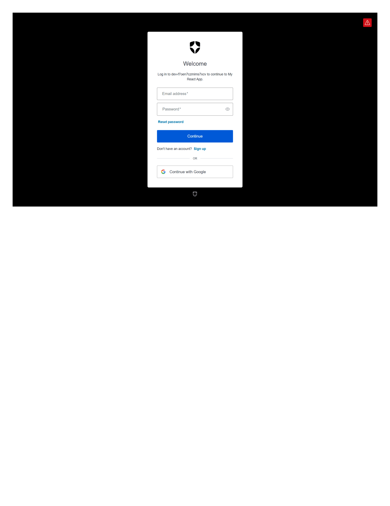

### Admin - Manage Books

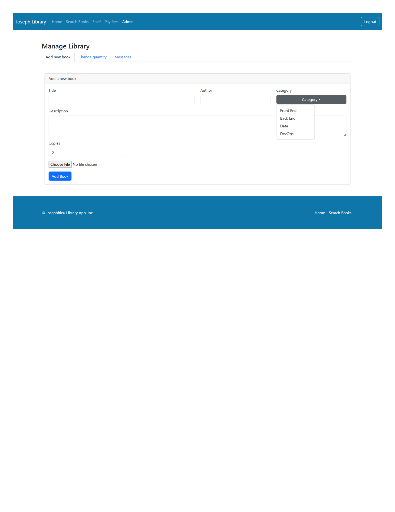

### Admin - Book Detail

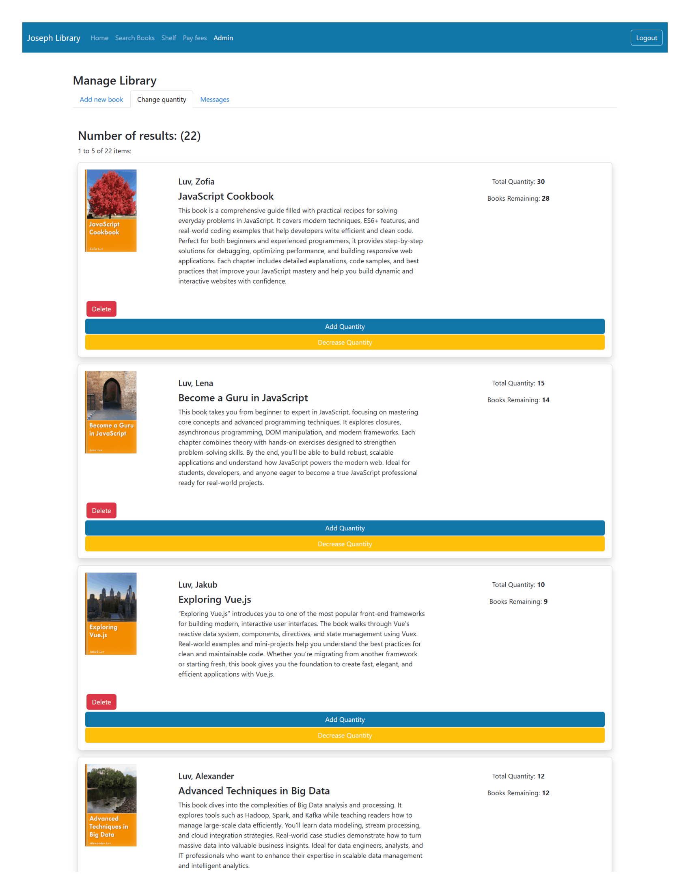

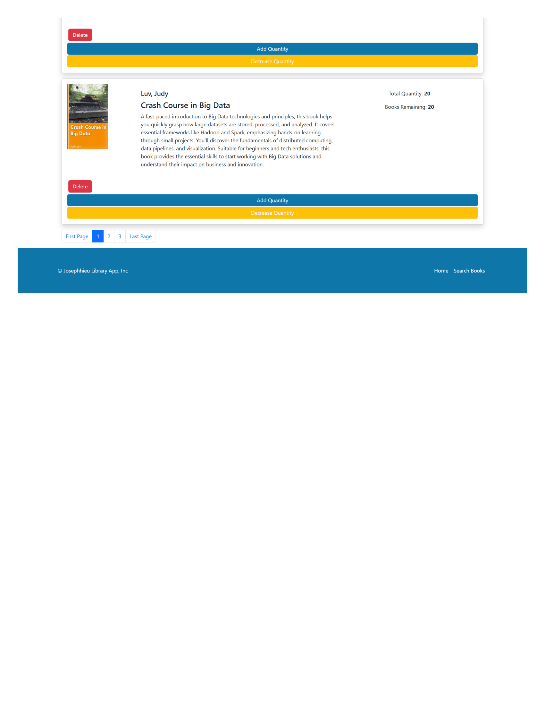

### Admin - Response

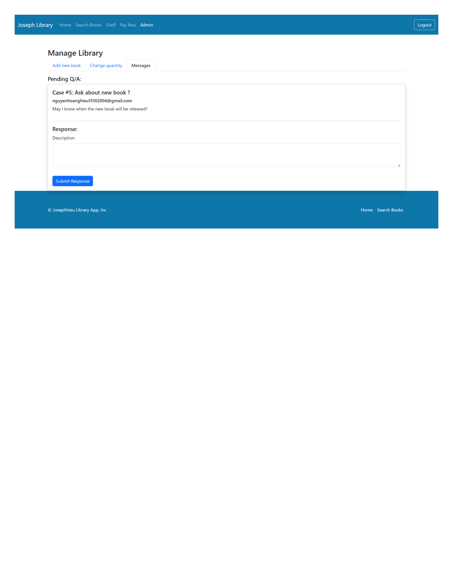

### User - Borrow Book

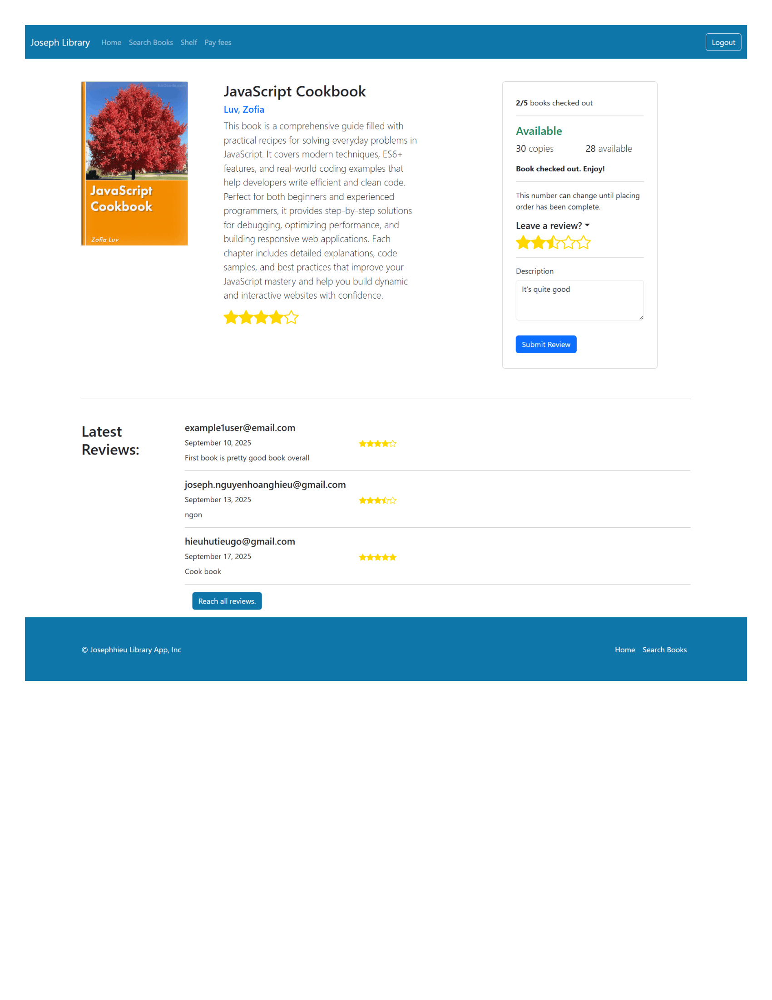

### User - Not Login


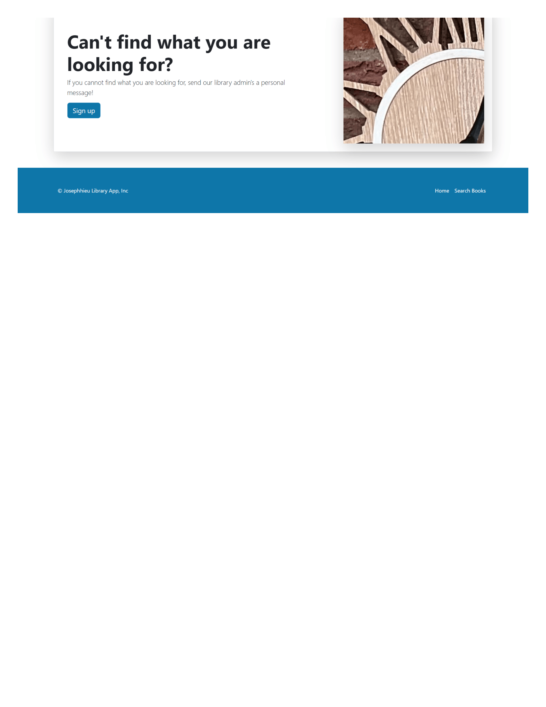

### User - Book Detail (Not Login)

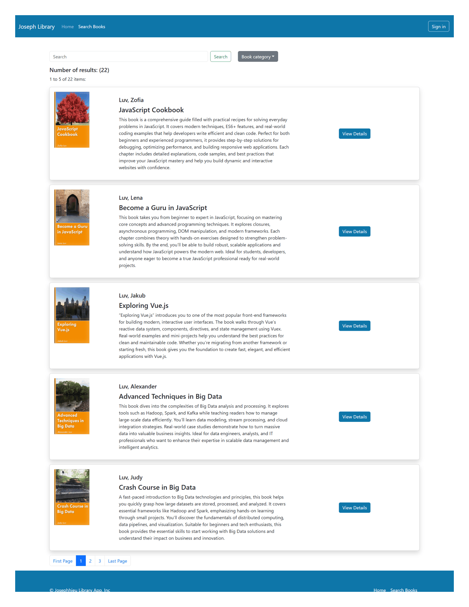


### User - Ask Question

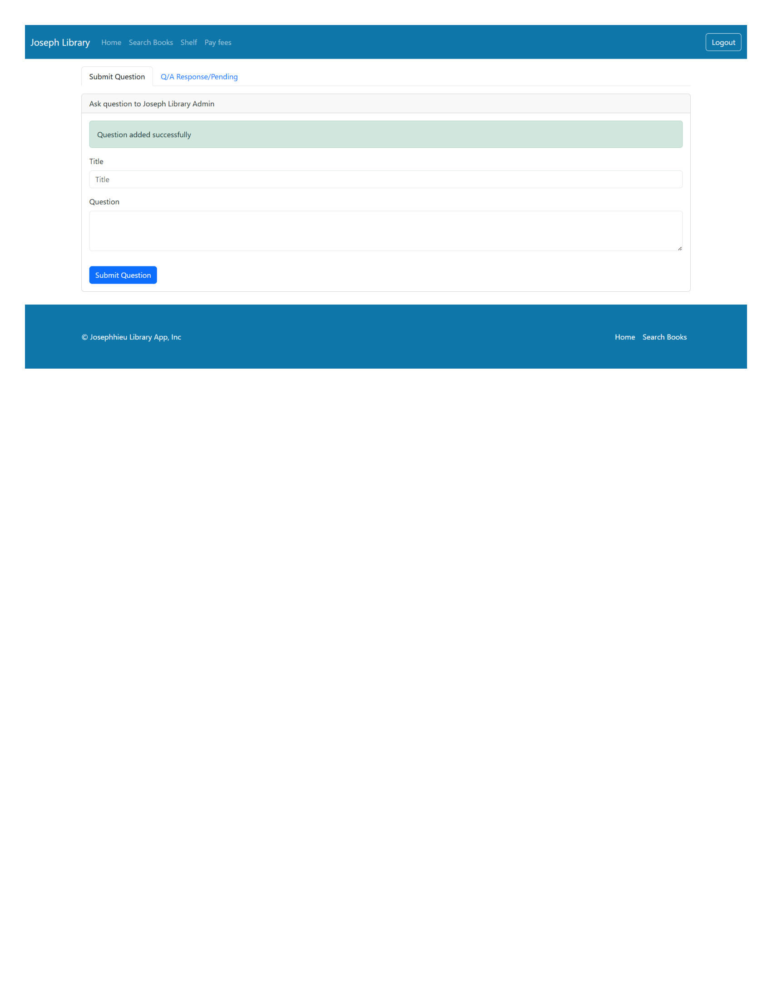

### User - View Answer

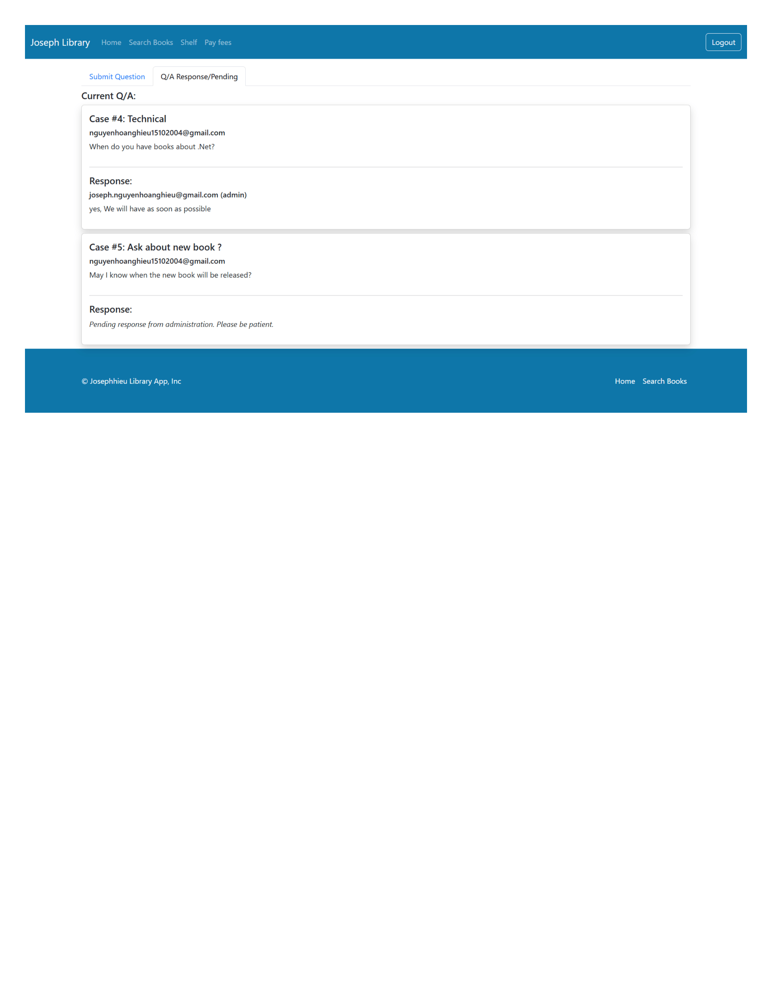

### User - Shelf

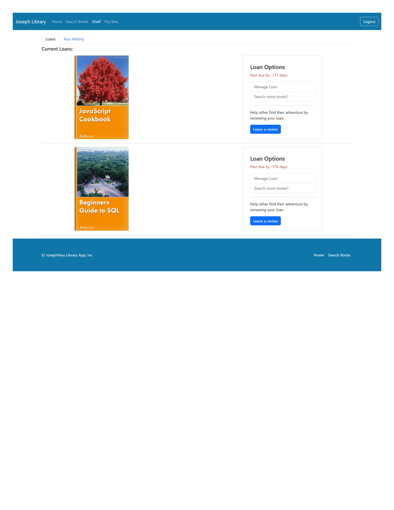

## Installation & Run

### Clone project

```bash
git clone https://github.com/JosephHieu/library-app.git
cd library-app
```

### Run Backend

```bash
cd 02-backend/spring-boot-library
./mvnw spring-boot:run
```

### Run Frontend

```bash
cd 03-frontend
npm install
npm start
```

👉 Frontend: http://localhost:3000
👉 Backend: http://localhost:8080


## 📂 Project Structure

```
library-app/
│
├── 01-starter-files/
├── 02-backend/
│   └── spring-boot-library/
├── 03-frontend/
├── doc/
│   └── images/
├── README.md
```

## Future Improvements

* Dockerize application
* CI/CD pipeline
* Improve UI/UX

## Author

**Hieu Nguyen**

## ⭐ If you like this project

Give it a ⭐ on GitHub!


Give it a ⭐ on GitHub!


